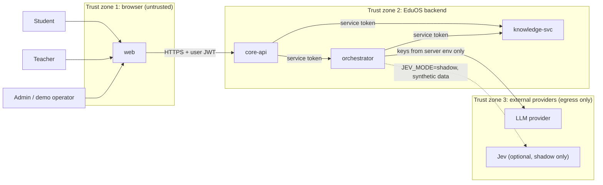
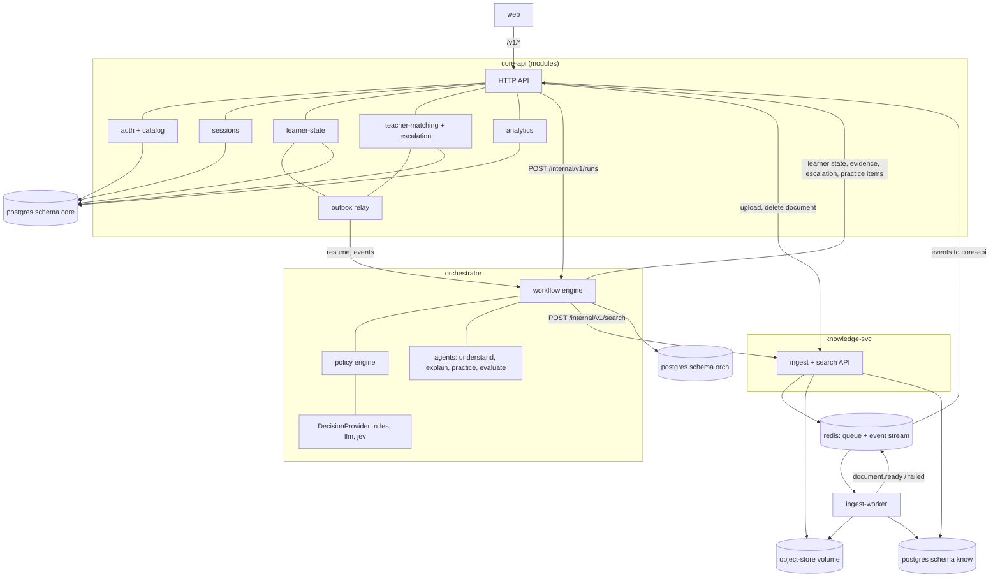
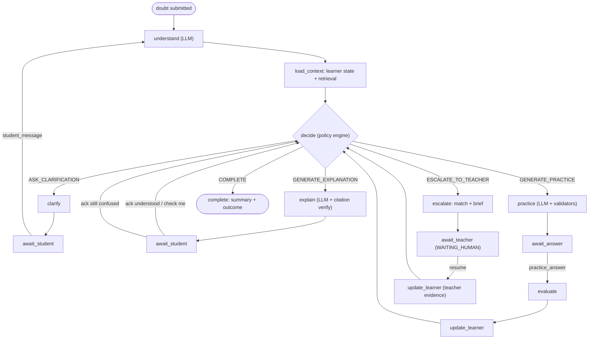
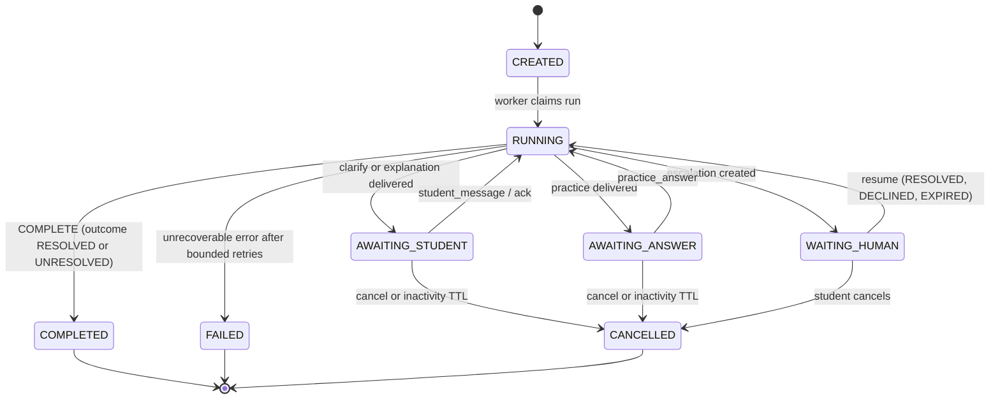
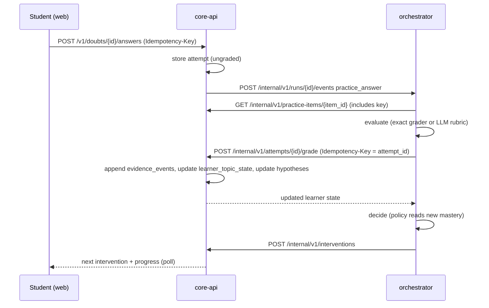
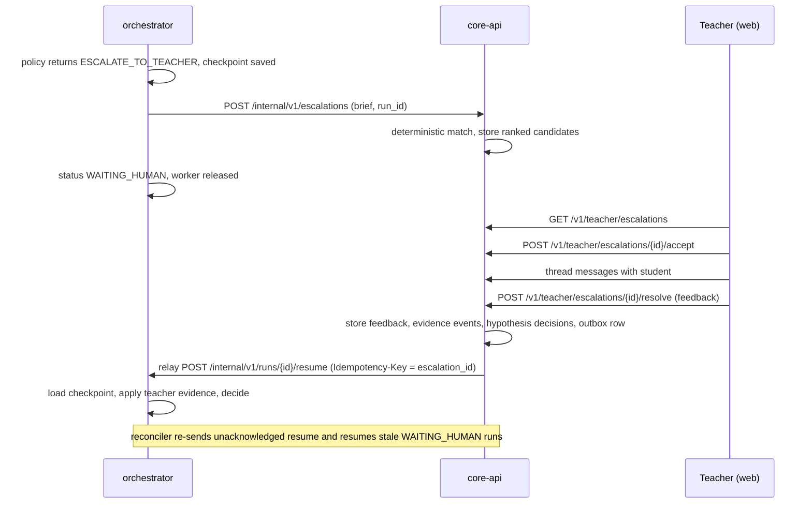
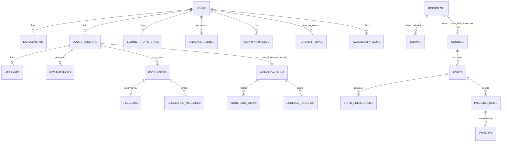
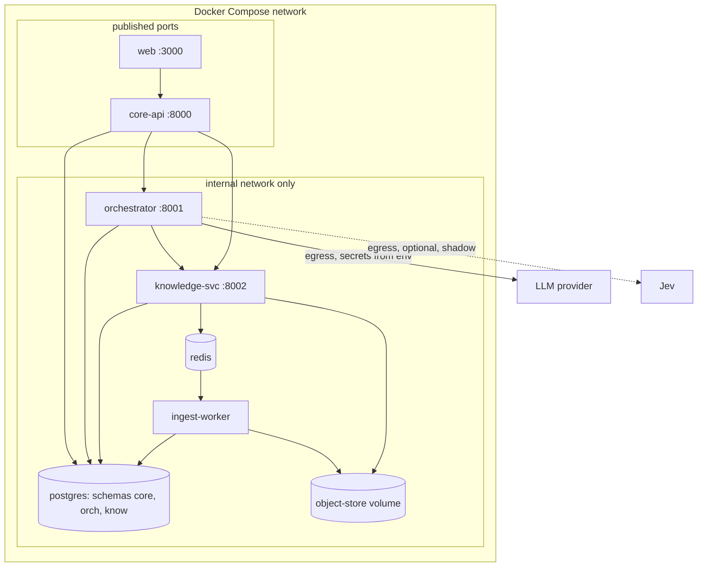

# EduOS Architecture

> **Scope update (Phases 3–5):** Jev is no longer in scope. Sections that discuss Jev / `JevDecisionProvider` are kept only as the historical record of ADR-001; nothing in the code depends on it and no Jev configuration exists. The deterministic R1–R10 engine is the only decision-maker; a decision-provider experiment may be added in a future phase. The as-built description is in [PHASE3_5_ACCEPTANCE.md](PHASE3_5_ACCEPTANCE.md).


| | |
|---|---|
| **Status** | Target design. Claims about behavior are requirements, not observations. **Update (2026-10-09):** the M1 vertical slice is implemented as a modular monolith; see [PHASE1_ACCEPTANCE](PHASE1_ACCEPTANCE.md) for what exists, what was verified, and deviations from this design. |
| **Version** | 0.1 (documentation stage, 2026-10-09) |
| **Scope** | Hackathon: The Industry Games 2026, District 03 (AI-Native Education OS for Intelligent Doubt Resolution, sponsored by ATOMTALK) |
| **Companion docs** | [IMPLEMENTATION_PLAN](IMPLEMENTATION_PLAN.md), [API_CONTRACTS](API_CONTRACTS.md), [AGENT_SPECIFICATIONS](AGENT_SPECIFICATIONS.md), [EVALUATION_PLAN](EVALUATION_PLAN.md), [README](../README.md) |

**Labelling convention.** *[Official]* = from the problem statement. *[Assumption]* = our assumption. *[Enhancement]* = our proposal beyond the problem statement. No ATOMTALK-specific requirements beyond the official problem statement have been supplied, and none are invented here.

---

## 1. Purpose and principle

EduOS is an educational **decision-support system**, not a generic chatbot. Core principle: *"Don't just answer the doubt. Understand the learner."*

[Official] Given a student's question, context and learning history, the system decides whether the student needs (a) an AI-generated explanation, (b) personalized practice, or (c) a relevant human teacher, and combines AI with human expertise.

## 2. Requirements

### 2.1 Roles

| Role | Capabilities |
|---|---|
| Student | Upload study material, submit doubts, answer clarifications and practice, request a teacher, view progress |
| Teacher | Manage availability and topic expertise, receive matched escalations, chat with the student, submit structured feedback |
| Admin / demo operator | Seed data, view run traces, analytics, and evaluation reports |

### 2.2 Functional requirements

| ID | Requirement |
|---|---|
| FR-1 | A student can submit a doubt (text) within a course; the system returns a tracked session. |
| FR-2 | The system infers topic, intent and clarity of the doubt (typed, validated output). |
| FR-3 | The system retrieves the student's learner state for the topic and its prerequisites. |
| FR-4 | The system retrieves passages from the student's authorized course material (hybrid retrieval). |
| FR-5 | A deterministic policy selects exactly one of `ASK_CLARIFICATION`, `GENERATE_EXPLANATION`, `GENERATE_PRACTICE`, `ESCALATE_TO_TEACHER`, `COMPLETE`, and records the rule that fired. |
| FR-6 | Explanations cite source passages; citations are verified before display. |
| FR-7 | Practice items are generated for a topic or a gap hypothesis, validated, and graded (exact where possible). |
| FR-8 | Every graded attempt creates an evidence event; mastery is derived from evidence only. |
| FR-9 | Suspected gaps are stored as hypotheses and become confirmed only under the rules in §8.3. |
| FR-10 | Escalation matches teachers deterministically, pauses the workflow, and resumes it when the teacher resolves. |
| FR-11 | Teacher feedback is stored and converted to bounded evidence. |
| FR-12 | Students see progress; admins see analytics and per-run decision traces. |
| FR-13 | Document deletion removes chunks and embeddings and prevents later retrieval. |

### 2.3 Non-functional requirements

| ID | Requirement |
|---|---|
| NFR-1 | Every AI-influenced decision is auditable (inputs, rule, model/prompt version, output). |
| NFR-2 | All loops are bounded by explicit budgets; no unbounded agent recursion. |
| NFR-3 | Every external call has a timeout and bounded retries; every LLM node has a deterministic fallback. |
| NFR-4 | Student data isolation and document access control are enforced server-side. |
| NFR-5 | Secrets never reach the browser or logs. |
| NFR-6 | Cross-service writes are idempotent. |
| NFR-7 | The system runs locally with `docker compose` and can run end-to-end with a fake LLM (no credentials). |
| NFR-8 | Latency is measured and reported (no targets are asserted before measurement). |

### 2.4 Core user journeys

1. **Doubt → grounded explanation → check → complete.** Student asks; system explains with citations; student asks for a check; practice passes; session completes.
2. **Ambiguous doubt → clarification → explanation.**
3. **Repeated failure → escalation → teacher resolves → resume → updated mastery.**
4. **Upload material → indexed → searchable → deleted → no longer retrievable.**
5. **Teacher discovers matched escalation, chats, resolves with structured feedback.**

### 2.5 Out of scope (this build)

Real-time video/voice, payments/scheduling marketplaces, mobile apps, multi-tenant organization management, multimodal doubts (images/diagrams) beyond OCR of uploaded PDFs, a knowledge graph store, fine-tuned models, production-grade scaling, and claims of measured learning outcomes. "Live or one-to-one" is satisfied by an asynchronous thread plus a booked availability slot **[Assumption A3]**.

### 2.6 Minimum end-to-end workflow (demo spine)

Upload Computer Networks notes → ask a doubt → grounded cited explanation → check question graded → evidence updates mastery → repeated failure → escalation → teacher resolves → run resumes → progress shows the change. Every capability in §2.2 hangs off this spine.

---

## 3. Approved decisions

Approved by the team after the architecture review.

| ID | Decision |
|---|---|
| D-01 | Explicit persisted workflow, deterministic intervention policy. Hand-rolled state machine (no LangGraph unless a concrete implementation issue justifies it, which would be recorded as a new ADR). |
| D-02 | Services: `core-api`, `orchestrator`, `knowledge-svc`, plus `ingest-worker`. Modular-monolith fallback preserved (§14). |
| D-03 | PostgreSQL with service-owned schemas, pgvector, full-text search, hybrid retrieval. |
| D-04 | Three LLM agents (Doubt Understanding, Explanation, Practice Generation) + hybrid Answer Evaluation. Retrieval, learner-state updates, intervention policy, teacher matching, analytics are deterministic. |
| D-05 | Evidence ledger + Beta-Bernoulli model with recency decay. A gap is never confirmed from a single unverified hypothesis. |
| D-06 | Knowledge graph deferred; `topic_prerequisite` table. |
| D-07 | `DecisionProvider` interface, rules as default. Jev evaluated in shadow mode against rules and a structured-output LLM, synthetic data only, not on the critical path before experiment and privacy review (ADR-001, §13). |
| D-08 | Demo course: **Computer Networks**, seeded material and teacher accounts. |
| D-09 | LLM provider abstraction. No credentials or budget assumed. |
| D-10 | Secrets server-side, access control, validated outputs, bounded retries/timeouts, audit logs, resumable human escalation. |

## 4. Open items (no blocking decisions remain)

None of these block Milestone M1 ([IMPLEMENTATION_PLAN §3](IMPLEMENTATION_PLAN.md)). Each has a default so work can start.

| # | Item | Default used until confirmed | Needed by |
|---|---|---|---|
| O-1 | LLM provider, API credentials, budget | `FakeLLM` (canned, schema-valid outputs). No real-LLM quality claims until a provider is configured. | Phase 3 (real-LLM evaluation) |
| O-2 | Embedding model | A local open sentence-embedding model chosen in a Phase 2 spike; dimension via env var `EMBEDDING_DIM`. A deterministic hash embedder is used in tests. | Phase 2 |
| O-3 | Computer Networks seed material | Team authors short notes (or uses openly licensed text) for ~5 topics. Copyrighted textbook text is not committed. | Phase 2 |
| O-4 | Frontend stack | React + TypeScript + Vite. Replaceable; the API contract is the interface. | Phase 1 |
| O-5 | Jev API key and retention/training-use terms | Jev disabled (`JEV_MODE=off`). Synthetic data only. | Phase 6 experiment |
| O-6 | Python / tooling | Python 3.11+, FastAPI, Pydantic v2, SQLAlchemy 2 + Alembic, `arq` for the queue, `pytest`. | Phase 1 |
| O-7 | Auth token handling | Short-lived JWT, held in memory by the SPA. Known XSS trade-off accepted for the demo. | Phase 1 |

---

## 5. System context



## 6. Services and data ownership



### 6.1 Ownership table

| Service | Responsibility | Owns (schema) | May call |
|---|---|---|---|
| `core-api` | Public API/BFF, authN/authZ, catalog, sessions/messages/interventions, learner state + evidence + hypotheses, practice items + attempts, teachers/availability/matching/escalations/feedback, analytics, audit, outbox | `core.*` | `orchestrator`, `knowledge-svc` |
| `orchestrator` | Workflow engine, policy engine, agents, `DecisionProvider`, LLM provider abstraction, step/decision audit | `orch.*` | `knowledge-svc`, `core-api` (internal API) |
| `knowledge-svc` | Document registry, parsing/OCR, chunking, embeddings, hybrid search, deletion | `know.*` | none (Redis, object store) |
| `ingest-worker` | Runs ingestion jobs (same image as `knowledge-svc`, different entrypoint) | `know.*` (via same code) | none |

**Rules.** (1) Each service connects with its own Postgres role that has privileges only on its schema. (2) No cross-schema reads or writes; only API calls. (3) `libs/contracts` shares Pydantic schemas only, never ORM models. (4) The browser talks only to `core-api`.

### 6.2 Communication

| Path | Protocol | Why |
|---|---|---|
| web → core-api | HTTPS/JSON (polling for results in MVP; SSE is a stretch) | Simple, testable |
| core-api → orchestrator, orchestrator → knowledge-svc/core-api | Synchronous HTTP/JSON with service token | Request path needs answers now |
| Ingestion jobs | PostgreSQL job table (source of truth) + Redis wake-up queue; separate `worker` process (**as built: ADR-008**, not `arq`) | Long-running, retryable, off the request path |
| `document.ready/failed/deleted` | Redis Stream `eduos.events`, consumer group per service | Decoupled notification |
| `escalation.resolved` → run resume | Outbox row in `core.outbox` → relay calls `POST /internal/v1/runs/{id}/resume` with retry | No dual-write loss |

No Kafka, no Kubernetes: no demonstrated need at this scale.

### 6.3 Cross-service consistency

- **Idempotency.** Every state-changing cross-service call carries `Idempotency-Key`. Receivers store `(key, request_hash, response)` in a per-schema `idempotency_keys` table and replay the stored response; the same key with a different hash returns `409 IDEMPOTENCY_KEY_REUSED`.
- **Outbox.** `core.outbox` rows are written in the same transaction as the state change; the relay retries until acknowledged.
- **Natural dedupe keys.** `evidence_events UNIQUE(source, ref_id)`; `attempts UNIQUE(student_id, idempotency_key)`; `workflow_runs UNIQUE(session_id, trigger_id)`.
- **Reconciler** (periodic, in `orchestrator` and `core-api`): re-sends unacknowledged outbox rows; resumes `WAITING_HUMAN` runs whose escalation is already `RESOLVED`; marks stale `RUNNING` runs (heartbeat expired) for retry.
- **Optimistic locking.** `workflow_runs.version` is checked on every checkpoint write.

---

## 7. Orchestration

### 7.1 Workflow graph



`understand` re-runs after a clarification reply and refreshes `load_context`.

### 7.2 Persisted workflow state

Stored as JSONB in `orch.workflow_runs.state`, validated by the `WorkflowState` Pydantic model ([AGENT_SPECIFICATIONS §2](AGENT_SPECIFICATIONS.md)). Fields: identifiers, `status`, `current_node`, `counters` (actions used, clarify rounds, explanation attempts, practice sets, failed checks, LLM calls, tokens), `budgets`, `analysis`, `context` (mastery summary, retrieval summary with chunk IDs), `last_decision`, `pending` (what the run is waiting for), `flags` (`explicit_teacher_request`, `safety_flag`, `teacher_unavailable`), and `version`. Each node execution also appends an immutable row to `orch.workflow_steps`.

### 7.3 Run status transitions



| From | Event | To | Side effects |
|---|---|---|---|
| CREATED | worker claims | RUNNING | heartbeat started |
| RUNNING | clarify node done | AWAITING_STUDENT | intervention row, `pending=student_message` |
| RUNNING | explain node done | AWAITING_STUDENT | intervention row with verified citations |
| RUNNING | practice node done | AWAITING_ANSWER | practice items saved (keys stay server-side) |
| RUNNING | escalate node done | WAITING_HUMAN | `core` escalation created, checkpoint saved, worker released |
| RUNNING | decide → COMPLETE | COMPLETED | summary, `outcome` recorded |
| RUNNING | retries exhausted on non-fallbackable error | FAILED | audit event; student told; session offers "request teacher" |
| AWAITING_* | valid event | RUNNING | event applied to state, idempotent by event ID |
| WAITING_HUMAN | resume `RESOLVED` | RUNNING | teacher evidence applied first, then `decide` |
| WAITING_HUMAN | resume `DECLINED`/`EXPIRED` | RUNNING | `flags.teacher_unavailable=true`, then `decide` ends as COMPLETED/UNRESOLVED |
| Any non-terminal | cancel / TTL | CANCELLED | pending escalation cancelled |

Events arriving for a run in the wrong status return `409 INVALID_RUN_STATE`. Duplicate event IDs return the stored result.

### 7.4 Bounds, retries, fallbacks

| Control | Default (config, tunable) |
|---|---|
| `MAX_ACTIONS` (clarify/explain/practice/escalate executions per run) | 6 |
| `MAX_CLARIFY_ROUNDS` | 2 |
| `MAX_EXPLAIN_ATTEMPTS` | 2 |
| `MAX_PRACTICE_SETS` | 2 |
| `MAX_RUN_TOKENS` | set once a provider/budget is confirmed |
| LLM node timeout / retries | 30s / 1 repair retry on schema failure + 2 backoff retries on provider error |
| Retrieval timeout | 3s, 1 retry |
| `ESCALATION_TTL` | configurable, must be set before demo |

Exceeding a bound routes through policy rule R2 (§8). These are initial values, **not** tuned results.

| Node | On failure |
|---|---|
| `understand` | Treat as `clarity=ambiguous`, ask a generic clarification |
| `explain` | After one regeneration, show the retrieved passages with a "could not generate an explanation" notice |
| `practice` | Discard invalid items; if none valid, skip to explanation or escalation per policy |
| `evaluate` (LLM rubric) | Mark `grader_unavailable`; do not write evidence; ask student to retry or escalate |
| `retrieval` | `retrieval_support` unavailable → rule R4 escalates, never silently answers ungrounded |
| `decide` | Pure code; cannot fail on provider outage. Advisor failure → rules result |

---

## 8. Intervention policy

### 8.1 Three separate quantities

| Quantity | Source | Meaning | Used for |
|---|---|---|---|
| `classification_confidence` | `understand` agent self-report | The model's belief that it parsed the doubt correctly | Whether to clarify |
| `retrieval_support` | Deterministic from retrieval: `{n_chunks_above_threshold, top_dense_similarity, lexical_hits}` | Whether course material covers the doubt | Whether an explanation can be grounded |
| `mastery` | Evidence ledger only | What the student has demonstrated | Practice, completion, escalation |

Model confidence is never used as mastery. A student's self-described confusion creates a hypothesis, not evidence.

### 8.2 Ordered rules (first match wins)

| Rule ID | Condition | Action |
|---|---|---|
| `R1_explicit_teacher_request` | `flags.explicit_teacher_request` | ESCALATE_TO_TEACHER |
| `R1b_safety_flag` | `flags.safety_flag` (distress, integrity, out-of-policy) | ESCALATE_TO_TEACHER |
| `R2_budget_exhausted` | Any budget exceeded | ESCALATE_TO_TEACHER, or COMPLETE with `outcome=UNRESOLVED` if `teacher_unavailable` |
| `R3_needs_clarification` | `clarity != clear` or `classification_confidence < T_CLARIFY`, and `clarify_rounds < MAX_CLARIFY_ROUNDS` | ASK_CLARIFICATION |
| `R4_no_grounding` | `n_chunks_above_threshold < RET_MIN_CHUNKS` | ESCALATE_TO_TEACHER (or UNRESOLVED if `teacher_unavailable`) |
| `R5_repeated_failure` | ≥2 failed checks after an explanation on this topic, or the same `error_tag` ≥3 times in the learner's recent attempts | ESCALATE_TO_TEACHER (or UNRESOLVED if `teacher_unavailable`) |
| `R6_low_evidence_explain` | Topic mastery status in {unknown, hypothesis, emerging-with-low-mean} and no explanation delivered this run, or student reported still confused and `explain_attempts < MAX_EXPLAIN_ATTEMPTS` | GENERATE_EXPLANATION |
| `R7_check_after_explanation` | Explanation delivered, student acknowledged understood or requested a check, and no check yet | GENERATE_PRACTICE |
| `R8_mastery_demonstrated` | Check passed and topic status `demonstrated` (§9) | COMPLETE (`outcome=RESOLVED`) |
| `R9_retry_explain_new_angle` | Check failed once, `explain_attempts < MAX_EXPLAIN_ATTEMPTS` | GENERATE_EXPLANATION (uses error tags) |
| `R10_default_clarify` | None of the above | ASK_CLARIFICATION |

Thresholds `T_CLARIFY`, `RET_MIN_SIM`, `RET_MIN_CHUNKS`, `T_MASTER`, `N_MIN` are config values with **no asserted defaults**; they are set from the evaluation set ([EVALUATION_PLAN §6](EVALUATION_PLAN.md)). The unit tests assert rule *ordering and behavior at boundaries* using arbitrary test thresholds, not tuned values.

**Termination guarantee.** Every non-terminal rule that produces an action increments `actions_used`; R2 fires when it reaches `MAX_ACTIONS`; R2 then escalates or terminates. Hence every run terminates or waits for a human.

### 8.3 Hypotheses vs confirmed gaps

`gap_hypotheses.status ∈ {proposed, confirmed, refuted, expired}`.
- Created `proposed` by `understand` (an LLM guess) or by the learner service from error tags. A proposed hypothesis has **zero weight** in mastery. It only steers practice generation.
- `confirmed` requires either (a) ≥2 failed attempts on **distinct** practice items that target the hypothesis, or (b) teacher confirmation in feedback.
- `refuted` when ≥2 correct attempts without hints on distinct targeting items, or teacher refutation.
- `expired` after a configurable period with no evidence.

### 8.4 Advisor hook (`DecisionProvider`)

The advisor may *propose* an action only when no rule R1–R5 fired and only among actions still allowed by remaining budgets. In `shadow` mode the proposal is logged and ignored. The policy's final action is always recorded alongside `advisor` and `overridden`. See ADR-001 (§13).

---

## 9. Learner model

Per `(student, topic)` row in `core.learner_topic_state`: `alpha`, `beta`, `evidence_count`, `distinct_items`, `last_evidence_at`, `status ∈ {unknown, hypothesis, emerging, demonstrated}`. Prior Beta(`ALPHA0`, `BETA0`), initially (1, 1).

**Update.** For each new evidence event with weight `w`:
1. Decay toward the prior: `alpha ← ALPHA0 + (alpha − ALPHA0)·0.5^(Δt / HALF_LIFE)`; same for `beta`.
2. Add `w` to `alpha` if polarity positive, to `beta` if negative.
3. Recompute `evidence_count`, `distinct_items`, status.

**Weights.** `w = base(source) × difficulty_factor × hint_factor`, `hint_factor = 1/(1 + hints_used)`. `base` per source (config): `attempt` full, `teacher_feedback` bounded and larger than a single attempt but capped, `self_report` = 0, `explanation_ack` = 0.

**Status.** `unknown`: no hypotheses or evidence. `hypothesis`: only proposed hypotheses. `emerging`: has evidence but not demonstrated. `demonstrated`: posterior mean ≥ `T_MASTER` **and** `evidence_count ≥ N_MIN` **and** `distinct_items ≥ 2`. One correct answer therefore cannot produce `demonstrated`; one wrong answer cannot confirm a gap.

**Evidence ledger.** `core.evidence_events` is append-only; `learner_topic_state` is a derived cache and can be rebuilt by replaying the ledger (tested: replay produces the same state).

**Prerequisites.** `core.topic_prerequisite(topic_id, requires_topic_id)` forms a DAG (cycle check on insert). A recursive CTE returns weak prerequisites of a topic; the practice agent receives them and may target them.

**Upgrade path.** Beta-Bernoulli → Bayesian Knowledge Tracing → item-difficulty calibration (IRT-style) → sequence models only if real data exists. The ledger interface stays unchanged.

---

## 10. RAG and knowledge

```mermaid
flowchart LR
  subgraph Ingest["asynchronous ingestion"]
    UP["core-api: authorize + forward upload"] --> KS["knowledge-svc: create document + job"]
    KS --> OS[("object-store")]
    KS --> RQ[("redis queue")]
    RQ --> IW["ingest-worker"]
    IW --> P["parse text layer, OCR only for pages without one"]
    P --> CH["chunk + metadata"]
    CH --> EM["embed"]
    EM --> PK[("postgres know.chunks: vector + tsvector")]
    IW -->|"document.ready / failed"| RQ
  end
  subgraph Retrieve["synchronous retrieval"]
    OR["orchestrator"] --> SQ["POST /internal/v1/search"]
    SQ --> ACL["SQL filter: enrolled course + visibility + status READY"]
    ACL --> DV["dense (pgvector)"]
    ACL --> LX["lexical (ts_rank over tsvector)"]
    DV --> RRF["RRF fusion"]
    LX --> RRF
    RRF --> RR["optional rerank (stretch)"]
    RR --> OR
    OR --> GEN["explain agent"]
    GEN --> VER["citation verifier (deterministic)"]
  end
  PK --> ACL
```



- **Ingestion statuses:** `UPLOADED → PARSING → INDEXING → READY | FAILED` (with `error_code`, retry count). Uploads are deduplicated by SHA-256 per owner.
- **Parsing:** text-layer extraction per page; OCR (Tesseract) only for pages with no text layer; record `parser` and `ocr_used` per chunk. The parser runs in the worker with CPU/memory/time limits.
- **Chunking:** by heading/paragraph structure, ~300–500 tokens with small overlap *(starting values, to be tuned)*. Metadata: `document_id, owner_id, course_id, page, section_path, chunk_index, content_hash, ingestion_version`.
- **Store:** pgvector + `tsvector` in `know.chunks`. Rationale: one datastore, ACL as a `WHERE` clause before ranking, transactional deletion. Switching to ChromaDB is not planned.
- **Retrieval:** SQL-level ACL filter first; dense and lexical run in parallel; Reciprocal Rank Fusion; optional cross-encoder rerank **only if** the retrieval evaluation shows a ranking gap.
- **Grounding & citations:** the explain agent must cite `chunk_id` + exact `quote`. The verifier checks (1) `chunk_id` ∈ retrieved set, (2) normalized `quote` is a substring (or high-similarity fuzzy match) of that chunk. Failed citations are removed; if all are removed the explanation is regenerated once, then replaced by the passage list. Citation existence is not entailment; entailment is sampled by humans ([EVALUATION_PLAN §3.3](EVALUATION_PLAN.md)).
- **Missing information:** rule R4 escalates; the explainer may not present general-knowledge content as course-grounded. If general-knowledge supplements are enabled, they are labelled "not from your materials".
- **Conflicts:** both sources are surfaced; the explainer must not silently choose.
- **Untrusted content:** chunks are passed as delimited data; the explain/practice agents have no tools; outputs are schema-validated; chunks containing instruction-like patterns are flagged in the audit log.
- **Deletion/re-index:** delete removes object, chunks and embeddings in one transaction and emits `document.deleted`. Re-index bumps `ingestion_version` and swaps atomically. Past citations to a deleted chunk render as "source removed".

---

## 11. Feedback and learner-state loop



## 12. Teacher escalation and resumption



Teacher matching (deterministic, `core-api`): hard constraints — teacher covers the topic (`teacher_topics`), is not the requesting student, has availability within the configured window (or the request is queued). Score = weighted sum of topic proficiency, smoothed past-feedback rating on the topic, availability proximity, and current load; weights are config. Output is a ranked list with the per-component breakdown stored for audit. Optionally an LLM drafts the one-paragraph brief summary **[Enhancement]**; the brief's structured fields are deterministic.

Escalation statuses: `OPEN → ACCEPTED → RESOLVED`, or `EXPIRED` / `CANCELLED`. First accept wins (optimistic lock). An `OPEN` escalation with no candidates stays visible to all teachers of the course until `ESCALATION_TTL`.

Teacher feedback → evidence: `solid` → positive, `struggling` → negative, `emerging` → informational only; plus optional confirm/refute of hypotheses.

---

## 13. ADR-001: Jev (typed decision API)

- **Status:** Proposed (approved in principle as D-07: shadow-mode evaluation only).
- **Decision:** **Defer adoption.** Implement `DecisionProvider`; evaluate Jev in **shadow mode** on synthetic data against the rules and a structured-output LLM on use cases 1 and 5; keep use cases 2 and 4 deterministic; treat use case 3 as lower-priority/second experiment. Do not place Jev on the critical path before the experiment and a privacy review.

### 13.1 Context and sources

**Official** ([thejevai.com](https://thejevai.com), [docs](https://thejevai.com/docs), [API](https://thejevai.com/jev-api), [OpenRouter listing](https://openrouter.ai/docs/guides/community/jev)), as read on 2026-10-09:
- Decision API, not a general chat model; "does not produce reasoning traces, explanations, or free-form text."
- `POST https://thejevai.com/v1/systemone`, Bearer auth; body `{model, state, questions}`; question types `choice` (≤255 options), `noul` (yes/no), `score` (2–10 levels); multiple questions per state; response `result.answers.<id>`; documentation states probabilities and a 0–1 confidence are returned. Model `typesafe/jev-1.13`, alias `~typesafe/jev-latest`; ~32k-token budget for state + questions; text/JSON only; English primary; 429/529 → exponential backoff; "probability and confidence are signals for automation, not a guarantee of business accuracy."
- Python and JS SDKs; also reachable via OpenRouter.
- **Gaps (not found in pages we could read):** complete response schema and field names for probabilities, determinism/seed controls, error body format, SLA, **data retention and training-use terms**. Pricing appears in two forms (direct credit packs; per-token billing via OpenRouter) that we cannot reconcile from official sources.

**Third-party / unverified:** speed multipliers, latency ranges, per-token price, company background, launch dates. Not relied upon.

### 13.2 Use-case assessment

| # | Use case | State → bounded question | Output consumed as | Verdict |
|---|---|---|---|---|
| 1 | Intervention selection | Sanitized numeric/enum state → `choice` {clarify, explain, practice, escalate} | Advisor input to rules R6–R10 only; accepted only if allowed and above `JEV_CONFIDENCE_MIN` | **Shadow experiment** |
| 2 | Next workflow step | Graph edges are fixed | n/a | **Reject** (determinism is the point of the graph) |
| 3 | Explanation relevance/grounding | doubt + explanation + quotes → `noul` relevance / `score` | Extra check; **never** replaces the deterministic citation verifier | **Experiment second**; entailment over long text is a hard task |
| 4 | Continue vs finish | Mastery, evidence, budgets | n/a | **Reject** (mastery must come from evidence) |
| 5 | Model/escalation route for hard doubts | doubt text + topic → `score` difficulty or `choice` {small, large, teacher-suggestion} | Selects LLM tier; teacher route is a *suggestion* to the policy | **Shadow experiment** (lowest-risk, cheapest to test) |

Incorrect-decision consequences and fallbacks: a wrong advisory pick in R6–R10 wastes a turn and is bounded by budgets; a wrong "do not escalate" cannot override R1–R5; a wrong tier choice costs money or quality but explanations still pass citation verification. Any invalid answer, low confidence, timeout or open circuit → rules result.

### 13.3 Alternatives

| | A. Rules | B. Structured-output LLM | C. Jev + safeguards |
|---|---|---|---|
| Transparency | Highest | Low–medium | Medium (probabilities, no reasoning) |
| Testability | Table-driven | Non-deterministic | Probabilistic; replayable on a pinned model version |
| Soft/ambiguous cases | Weak | Good | **Unproven here** |
| Latency / cost | ~0 / 0 | Highest | Vendor claims lower; **to be measured** |
| Risk | None | Provider drift/outage | New vendor, unknown retention, thin schema docs |

Rules remain the backbone. Whether C beats B is empirical; the experiment decides.

### 13.4 Experiment (smallest useful)

See [EVALUATION_PLAN §7](EVALUATION_PLAN.md). Synthetic states only; three arms (rules, structured-output LLM, Jev); metrics: accuracy/macro-F1, **recall on escalation-worthy states**, calibration and coverage-vs-accuracy, p50/p95 latency, cost, invalid-output rate, repeat-call stability. Adoption threshold is set by the team **before** running and recorded here. Time-boxed; if it slips, the default is reject for this build.

### 13.5 Integration design (only if adopted for advisory mode)

```python
class DecisionProvider(Protocol):
    async def decide(self, req: DecisionRequest) -> DecisionResult: ...
```

Implementations: `RulesDecisionProvider` (default), `LLMDecisionProvider`, `JevDecisionProvider`. Server-side in `orchestrator` only.

| Env var | Meaning |
|---|---|
| `JEV_MODE` | `off` (default) / `shadow` / `advisory` |
| `JEV_API_KEY` | Secret; never logged, never sent to the browser |
| `JEV_BASE_URL` | Defaults to the official endpoint |
| `JEV_MODEL` | **Pinned** version (not `latest`) |
| `JEV_TIMEOUT_MS`, `JEV_MAX_RETRIES` | Bounded; retry only 429/529 with jittered backoff |
| `JEV_CONFIDENCE_MIN` | Acceptance threshold (set from the experiment) |

Behavior: circuit breaker on repeated failure; the returned option must be in `allowed_options`; policy veto applied after; state is built server-side from data the actor is already entitled to, with student identifiers replaced by opaque IDs and no free text in synthetic/shadow runs; Jev cannot trigger actions, change authorization, skip grading, bypass escalation policy, or satisfy a human-approval requirement. Logged: model version, request hash, field names, probabilities, latency, credits used, `fallback`, `overridden`. No raw student text.

### 13.6 Consequences

Positive: no dependency on an unproven vendor; the abstraction also supports LLM swaps. Negative: ~half a day on an experiment that may find nothing. Revisit when the experiment completes or when retention terms are obtained.

---

## 14. Modular-monolith fallback

**Trigger.** At the Phase 1 gate ([IMPLEMENTATION_PLAN §4.1](IMPLEMENTATION_PLAN.md)), if the three-service skeleton has not delivered the vertical slice (milestone M1) within its timebox, collapse into one FastAPI app.

**How it stays cheap.** Services are already written as packages with explicit client interfaces (`CoreClient`, `KnowledgeClient`, `OrchestratorClient`). In the monolith these become in-process implementations of the same interfaces; schemas remain separate (`core`, `orch`, `know`) and the "no cross-schema access" rule still applies. The worker stays a separate process (it is a queue consumer). API contracts do not change.

---

## 15. Data model

Conventions: UUID primary keys, `created_at`/`updated_at` as `timestamptz` UTC, soft-delete only where stated, enums as Postgres `CHECK`/enum types. Owner shown per schema.

### 15.1 `core` schema (owner: `core-api`)

| Table | Key columns | Notes |
|---|---|---|
| `users` | `id, role (student/teacher/admin), display_name, email, password_hash` | Demo accounts seeded; no unnecessary PII |
| `courses`, `topics` | `courses(id, name)`, `topics(id, course_id, name, sort)` | Computer Networks seeded |
| `topic_prerequisite` | `(topic_id, requires_topic_id)` | DAG; cycle check on insert |
| `enrollments` | `(student_id, course_id)` | Basis of document/retrieval ACL |
| `document_refs` | `id (= know document id), owner_id, course_id, title, status, created_at` | Mirror of status from `document.*` events; no chunk data |
| `doubt_sessions` | `id, student_id, course_id, topic_id, status, run_id, created_at` | |
| `messages` | `id, session_id, role (student/system/teacher), content, created_at` | |
| `interventions` | `id, session_id, run_id, action, rule_id, payload jsonb, created_at` | Explanations carry verified citations |
| `learner_topic_state` | `(student_id, topic_id) PK, alpha, beta, evidence_count, distinct_items, last_evidence_at, status` | Derived cache |
| `evidence_events` | `id, student_id, topic_id, source, polarity, weight, ref_id, created_at`, `UNIQUE(source, ref_id)` | Append-only |
| `gap_hypotheses` | `id, student_id, topic_id, description, status, source_run_id, created_at, resolved_at` | See §8.3 |
| `practice_items` | `id, topic_id, kind, prompt, options jsonb, answer_key, rubric, targets_hypothesis_id, created_by_run, validated` | `answer_key` never returned to clients |
| `attempts` | `id, student_id, item_id, answer, correct, partial_credit, error_tags, hints_used, grader, idempotency_key, created_at`, `UNIQUE(student_id, idempotency_key)` | |
| `teachers` | `user_id, bio` | |
| `teacher_topics` | `(teacher_id, topic_id), proficiency` | |
| `availability_slots` | `id, teacher_id, start_at, end_at, booked_by_escalation_id` | |
| `escalations` | `id, session_id, run_id, student_id, topic_id, status, brief jsonb, candidates jsonb, accepted_by, expires_at, created_at, resolved_at` | `UNIQUE(run_id)` per active escalation |
| `escalation_messages` | `id, escalation_id, author_id, content, created_at` | Teacher–student thread |
| `feedback` | `id, escalation_id, teacher_id, notes, topic_assessments jsonb, hypothesis_decisions jsonb, created_at` | |
| `audit_events` | `id, actor_id, action, entity, entity_id, meta jsonb, at` | Append-only |
| `outbox` | `id, target, kind, payload, idempotency_key, status, attempts, next_attempt_at` | |
| `idempotency_keys` | `key, scope, request_hash, response, created_at` | |

### 15.2 `orch` schema (owner: `orchestrator`)

| Table | Key columns |
|---|---|
| `workflow_runs` | `id, session_id, student_id, trigger_id, status, current_node, state jsonb, version, heartbeat_at, created_at, updated_at`, `UNIQUE(session_id, trigger_id)` |
| `workflow_steps` | `id, run_id, seq, node, input_hash, output jsonb, model, prompt_version, provider, latency_ms, tokens_in, tokens_out, error, created_at` |
| `decision_records` | `id, run_id, rule_id, action, inputs_snapshot jsonb, advisor jsonb, overridden bool, created_at` |
| `run_events` | `id (client event id), run_id, type, payload, applied_at` (dedupe) |
| `idempotency_keys` | as above |

### 15.3 `know` schema (owner: `knowledge-svc`)

| Table | Key columns |
|---|---|
| `documents` | `id, owner_id, course_id, sha256, filename, status, error_code, ingestion_version, created_at, deleted_at`, `UNIQUE(owner_id, sha256)` |
| `chunks` | `id, document_id, course_id, owner_id, page, section_path, chunk_index, text, content_hash, parser, ocr_used, embedding vector(EMBEDDING_DIM), tsv tsvector, ingestion_version` |
| `ingestion_jobs` | `id, document_id, status, attempts, last_error, created_at` |
| `idempotency_keys` | as above |

`know.chunks` carries `course_id` and `owner_id` so ACL filtering needs no cross-schema join; enrollment is passed in the search request by the caller (the orchestrator receives the allowed course IDs from `core-api`).

### 15.4 Entity relationships



Cross-schema relationships are by value (IDs), never foreign keys.

---

## 16. Security controls

| ID | Threat | Control |
|---|---|---|
| SEC-1 | Unauthenticated access | JWT verified in `core-api`; roles `student/teacher/admin`; internal endpoints reachable only on the internal Compose network and require a service token |
| SEC-2 | Cross-student data access | Every query scoped by `student_id`/enrollment; teachers see only escalations they can accept/accepted; negative tests for each endpoint |
| SEC-3 | Document leakage | ACL as SQL `WHERE` before ranking; no direct object-store paths to clients; signed short-lived download URLs via `core-api` |
| SEC-4 | Secret exposure | Env vars from an untracked `.env`; `.env.example` has names only; secrets scrubbed from logs; Jev/LLM clients only in `orchestrator` |
| SEC-5 | Prompt injection via documents/doubts | Delimited data, "data not instructions" system rule, no tools on generation paths, schema-validated outputs, citation verification, enum-restricted policy actions, flagged patterns logged |
| SEC-6 | Malformed LLM output | Pydantic `extra=forbid`; one repair retry; deterministic fallback; never executed or rendered as HTML |
| SEC-7 | Malicious uploads | Size/MIME sniffing, worker isolation with CPU/memory/time limits, parser errors → `FAILED` |
| SEC-8 | Abuse / cost exhaustion | Per-user rate limits (requests, uploads, doubts/day), per-run token budget |
| SEC-9 | Answer-key leakage | `answer_key` excluded from all public serializers; test asserts absence |
| SEC-10 | Excess PII | Minimal user fields; opaque `student_ref` to external providers; no raw identifiers to Jev |
| SEC-11 | Untraceable actions | Append-only `audit_events`; `workflow_steps`, `decision_records` |
| SEC-12 | Human-approval bypass | Escalation and teacher feedback are only advanced by `core-api` endpoints with teacher role; no model output can resolve an escalation |
| SEC-13 | Retention / deletion | Document delete cascade; student deletion anonymizes evidence; retention periods configurable, none asserted |

## 17. Reliability and observability

- Health: `/healthz` (process), `/readyz` (DB, queue, config) per service.
- Structured JSON logs with `trace_id` propagated via `X-Trace-Id`; per-node latency/token/error metrics from `workflow_steps`.
- Fault injection scenarios are part of acceptance ([IMPLEMENTATION_PLAN](IMPLEMENTATION_PLAN.md), Phase 6): knowledge-svc down, LLM timeout, invalid JSON, duplicate resume, worker crash mid-run.
- OpenTelemetry export is a stretch goal.

## 18. Deployment



One Postgres instance with three schemas and three roles; separate connection strings so a later split needs no code change. Isolation is logical, not physical — acceptable for the demo and disclosed.

## 19. Configuration summary

Env vars (names only): `DATABASE_URL_CORE`, `DATABASE_URL_ORCH`, `DATABASE_URL_KNOW`, `REDIS_URL`, `JWT_SECRET`, `SERVICE_TOKEN_SECRET`, `LLM_PROVIDER`, `LLM_API_KEY`, `LLM_MODEL_SMALL`, `LLM_MODEL_LARGE`, `EMBEDDING_PROVIDER`, `EMBEDDING_MODEL`, `EMBEDDING_DIM`, `MAX_ACTIONS`, `MAX_CLARIFY_ROUNDS`, `MAX_EXPLAIN_ATTEMPTS`, `MAX_PRACTICE_SETS`, `MAX_RUN_TOKENS`, `T_CLARIFY`, `RET_MIN_SIM`, `RET_MIN_CHUNKS`, `T_MASTER`, `N_MIN`, `HALF_LIFE_DAYS`, `ALPHA0`, `BETA0`, `ESCALATION_TTL`, `JEV_*` (§13.5). `LLM_PROVIDER=fake` is the default.

## 20. Other ADRs (summary; ADR-008 to ADR-012 were added in Phase 2, see section 21)

| ADR | Decision | Alternative rejected |
|---|---|---|
| 002 | Hand-rolled persisted state machine | LangGraph (extra dependency, no capability we need) |
| 003 | pgvector + FTS + RRF | ChromaDB (separate consistency/ACL/deletion path) |
| 004 | Beta-Bernoulli + ledger | Starting with BKT/DKT (data and complexity) |
| 005 | Three services + worker, monolith fallback | Per-agent services (no justification) |
| 006 | Deterministic policy, advisor-only models | LLM supervisor (untestable, unbounded) |
| 007 | Topic-prerequisite table | Knowledge graph store (no query we need beyond recursive CTE) |


---

## 21. Phase 2 architecture decisions (as built)

> Status of the whole document: sections 1-20 are the *target* design; these ADRs record what Phase 2 actually decided and built (see [PHASE2_ACCEPTANCE](PHASE2_ACCEPTANCE.md)). Where they differ, the ADRs describe the running code.

### ADR-008: Ingestion jobs live in PostgreSQL; Redis only wakes workers up
* **Context.** Ingestion must survive worker crashes, Redis outages and restarts, never process a document twice, and keep partial work invisible.
* **Decision.** `know.ingestion_jobs` is the source of truth (claim with `FOR UPDATE SKIP LOCKED`, lease + heartbeat via `lease_expires_at`, bounded retries with exponential backoff, a partial unique index = one active job per document). A Redis list carries wake-ups only; a periodic sweep re-announces due jobs and a reaper re-queues expired leases. The worker is the same application package started as `python -m app.worker`.
* **Alternatives rejected.** Redis-only queue (a lost Redis loses jobs, so a second durable record would be needed anyway); `arq`/Celery (extra framework, and recovery semantics still needed a DB record); a separate ingestion microservice (no benefit in a monolith).
* **Consequences.** Redis can be unavailable with no data loss (verified in Docker). Throughput is bounded by polling/claiming in PostgreSQL, adequate for this scale. The worker needs the same storage volume as the API.

### ADR-009: Hybrid retrieval = full text + pgvector fused with RRF, behind one interface, with visible fallback
* **Decision.** `build_retriever` is the only entry point. Hybrid runs the PostgreSQL full-text ranker and a pgvector cosine ranker (access control applied in SQL before ranking) and fuses them with reciprocal-rank fusion (k = 60, candidate pool 20, fixed a priori). Every result reports `mode_requested`, `mode_used`, `fallback_reason`, `degraded`. Missing embeddings, an absent extension, no active model, a model mismatch, an embedding error and an empty query all degrade to full text (or an empty result) and say so. Ties are broken by stable content keys, never UUIDs.
* **Embedding model control.** `know.embedding_models` registers (name, dims) and exactly one is `active`; search uses only the active model's vectors and refuses to run dense search if the configured model differs; switching is the explicit `python -m app.knowledge.reindex --activate`, after the new model is fully embedded. Old vectors are ineligible once retired and can be purged. A per-model partial HNSW index exists but the planner uses an exact scan at this size.
* **Why pgvector rather than Chroma.** One datastore, SQL-level access control, transactional deletion (embeddings cascade with chunks). pgvector is **optional infrastructure**: migrations and the application work without it.
* **Measured outcome.** On the 54-question set, hybrid does not rank better than full text beyond noise; it improves how many answerable questions are judged "supported" (TPR 0.875 → 1.0) at the cost of one extra hard negative on dev. Treat the benefit as unproven.

### ADR-010: Versioned documents; every change is an atomic swap
* **Decision.** `documents.ingestion_version` is the active version. Ingest, replace and re-index build the new chunks and, in **one transaction**, delete all previous chunks (embeddings cascade), insert the new ones, bump the version and finish the job. The previous version keeps serving until that commit; a failed or crashed attempt changes nothing. Retrieval additionally filters on `chunk.ingestion_version = document.ingestion_version` as defense in depth. Delete is a single transaction plus file removal. `know.document_events` is an append-only, FK-free, metadata-only audit trail that survives deletion.
* **Consequence.** No window in which two versions are searchable and none in which a document is READY without chunks (tested with a simulated hard crash).

### ADR-011: OCR is optional, page-level, budgeted, and runs in a sandboxed child process
* **Decision.** OCR only for pages whose text layer is nearly empty, only when `OCR_ENGINE` is set, with a per-document page budget, a pixel cap, per-page failure reporting (`extraction_report`) and no effect on ordinary text PDFs. Parsing runs in a child process (`parse_child`) with a wall-clock timeout everywhere and an address-space limit on POSIX; timeouts, crashes and limit hits become permanent job failures with specific error codes. Engine: RapidOCR (pip-installable, local); Tesseract is not implemented.
* **Consequences.** A hostile or pathological PDF can kill only its child process. Windows has no memory limit (timeout only). OCR accuracy on real scans is unmeasured.

### ADR-012: The evidence ledger is append-only, validated, and cannot carry mastery weight yet
* **Decision.** `core.evidence_events` accepts only registered types; in Phase 2 these are three self-report types pinned to **weight 0** by application validation *and* database CHECK constraints; a trigger rejects UPDATE/DELETE; `(evidence_type, source_ref)` is unique so duplicate deliveries cannot double-count; provenance (session, run, intervention, ack) is mandatory. Graded-attempt and teacher types are explicitly rejected until Phase 4 introduces the model that consumes them. An acknowledgment never changes mastery or confirms a gap.
* **Open issue.** Strict append-only conflicts with deleting or anonymizing a student's data; Phase 4 must define a controlled path (for example a privileged anonymization function with its own audit record).

### Data model additions in Phase 2 (migrations 0002 to 0005)
`know.embedding_models` (registry, one `active`), `know.chunk_embeddings` (`vector` column, created with raw SQL only when pgvector exists; FK to chunks and models with ON DELETE CASCADE), `know.ingestion_jobs` (kind `ingest | replace | reindex`, lease, attempts, `enqueue_error`, payload), `know.document_events`, new columns `know.chunks.ingestion_version`, `know.documents.extraction_report` and `updated_at`, and `core.evidence_events` (append-only, CHECK-constrained). Not yet built from section 15: `learner_topic_state`, `gap_hypotheses`, practice items, attempts, teachers, escalations, feedback.


## 22. ADRs added in Phases 3–5 (as built)

### ADR-013: Anonymisation keeps the append-only ledger and never silently rewrites history
- **Context:** evidence must be tamper-evident, but learners may need their personal data removed.
- **Decision:** an administrator can anonymise a student (`POST /v1/admin/students/{id}/anonymize`, explicit `confirm`). In one transaction: personal content (sessions, messages, attempts, private documents, escalations, workflow runs, the user's email and name) is deleted; every ledger row is **re-pointed to a pseudonym user** (a database trigger allows exactly that one column change, only while `eduos.anonymizing=on`; all other updates and every delete remain blocked); the audit record stores metadata only. The pseudonym cannot log in.
- **Consequences:** history is not erased and not rewritten; it is de-identified. There is **no promise of permanent retention** and no promise that de-identified evidence is unlinkable by a determined adversary with side information. Backups are outside this mechanism.

### ADR-014: Model providers sit behind one interface; the model proposes, deterministic code disposes
- `LLMProvider` (understand / explain / generate_practice / evaluate_answer). Implementations: `FakeLLMProvider` (deterministic, labelled), `PromptedProvider` over `OllamaBackend` or `OpenAICompatBackend`. Credentials are server-side; hosts outside loopback/private networks are refused unless `LLM_ALLOW_EXTERNAL=true`.
- The model is shown a **compact flat schema** (`app/llm/slim.py`) because a 3B model degraded badly (near-empty objects, `Infinity`) under the full internal schemas; the result is mapped onto the strict schemas, which still reject unknown or invalid fields. Malformed practice items are dropped one by one and lettered options / missing rubrics are repaired deterministically; nothing is invented.
- Output caps, bounded retries (a repeated identical request is asked at a warmer temperature), timeouts, model warm-up and `keep_alive`.
- Agents (`app/agents/*`) wrap every call with deterministic validators and fallbacks: invalid understanding -> clarification; unverifiable citations -> regenerate once, then passages only; practice items must pass leak/shape/duplicate checks (else a hand-authored seed bank); free-text grades above the uncertainty gate are shown but **not** counted as evidence.

### ADR-015: Mastery, Gap Map and Passport are read models over the ledger
- `learner_topic_state` and `mastery_history` are rebuildable caches; replaying the ledger reproduces them exactly (tested). Gap Map statuses are a pure function of (mastery view, hypotheses); the Passport adds a SHA-256 digest of its canonical content so reproducibility is checkable.
- Curated prerequisites (`core.topics.prerequisites`) only *suggest where to look*; they never change a status.

### ADR-016: Escalation is a persisted checkpoint with deterministic matching
- Matching is a weighted sum of five components (stored with every candidate). Access: the assigned teacher, or any course teacher while the case is OPEN and (they are a candidate or there are no candidates). Accept is race-safe (exactly one winner). Resolution writes bounded teacher evidence and resumes the run; a failed resume stays `pending` and a reconciler (worker and admin endpoint) applies it exactly once. Unanswered cases expire (48 h) and the run ends `UNRESOLVED`.

### ADR-017: Service boundaries - the modular monolith is kept (decision, not a gap)
- Target services (core-api, orchestrator, knowledge-svc, ingest-worker) exist as **modules with explicit gateways** (`CoreGateway`, `KnowledgeService`, schema-per-module ownership). Only `ingest-worker` is a separate process today. Splitting `knowledge-svc` out would add a network hop, service auth and a second deploy unit without fixing a problem we have; per the plan, extraction happens only when the integrated workflow is solid **and** there is a concrete benefit. Documented as **not extracted**; no empty services were created. Known cross-module read: the teacher case view reads course-visible chunks directly (`TeachingService.sources_for`); it would become a `knowledge-svc` call on extraction.


### ADR-018: Workflow transactions never span a model call; model use is bounded; model output is never sole evidence
- **Context:** the engine held a row lock (and a pooled connection) while waiting up to 2 x 120 s for a model; the model pool was unbounded in its queue; a steered grader could add positive evidence; audit rows were mutable.
- **Decision:**
  1. `WorkflowEngine._offload` commits, runs the slow call with no transaction open, then re-locks (`populate_existing`) and revalidates. Understand/explain/practice require the same run `version` and node (else `StaleRun`: the result is discarded). Free-text grading revalidates against the fresh state (the same item may not be scored twice; other items of the set may). Deterministic grading (multiple choice, numeric) stays in one transaction.
  2. A `RUNNING` run whose `updated_at` is younger than `WORKFLOW_LEASE_SECONDS` is never re-entered by a plain `advance` (`own=True` is used only by the caller that just set it). An expired lease means a crashed executor; the worker sweep (`workflow/recovery.py`) takes it over.
  3. Answer submission is retry-safe: the `Attempt` row is reused for the same `Idempotency-Key`.
  4. `llm/base.py` gate: at most `LLM_MAX_CONCURRENCY` model calls per process; a slot is released only when the call really ends (also after a caller timeout); no slot within `LLM_QUEUE_WAIT_S` fails fast as `busy` and the agent fallback applies.
  5. Per-user sliding-window limits (`RATE_LLM_ACTIONS_PER_MIN`, `RATE_DOUBTS_PER_HOUR`, in process memory) and database-backed login throttling (`LOGIN_MAX_FAILURES` per `LOGIN_WINDOW_MINUTES`, keyed by a hash of the address).
  6. Grading: instruction-like answers are never sent to the model; self-contradictory verdicts and positive verdicts lacking the reference answer's key terms (`GRADER_MIN_LEXICAL_SUPPORT`) are shown but not counted; model-graded evidence alone can never reach "demonstrated" (`MASTERY_MIN_TRUSTED_POSITIVE` exact-graded or teacher positives are required).
  7. `core.audit_events` is append-only by trigger (migration 0010); the only permitted rewrite is clearing `actor_id` inside an anonymization transaction.
- **Consequences / known ceilings:** rate-limit windows are per process (use Redis before running several API processes); `TRUNCATE` is not blocked; free-text answers that paraphrase heavily are more often "uncertain"; a crashed run is resumed within about one lease plus one sweep interval; a duplicated `POST /v1/doubts` with the same key racing at the same instant can still create two sessions (pre-existing, not addressed here).
