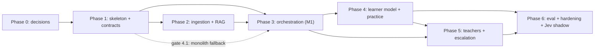

# EduOS Implementation Plan

| | |
|---|---|
| **Status** | Plan. Phase 1 / M1 and **Phase 2 are implemented** as a modular monolith (see [PHASE1_ACCEPTANCE](PHASE1_ACCEPTANCE.md) and [PHASE2_ACCEPTANCE](PHASE2_ACCEPTANCE.md) for what exists, what was run, and deviations); Phases 3-6 are not started except the pieces noted below. Acceptance test IDs in this file are planning labels; the tests that exist and pass are listed in the acceptance documents. |
| **Version** | 0.1 (2026-10-09) |
| **Related** | [ARCHITECTURE](ARCHITECTURE.md), [API_CONTRACTS](API_CONTRACTS.md), [AGENT_SPECIFICATIONS](AGENT_SPECIFICATIONS.md), [EVALUATION_PLAN](EVALUATION_PLAN.md) |

No calendar dates or durations are committed because the build window and team size are unknown. Effort is expressed in relative order and timeboxes to be set by the team in Phase 0.

## 1. Planned repository layout

```
edu_os/
  README.md
  docs/                         # these documents
  libs/contracts/               # Pydantic schemas shared across services (no ORM models)
  services/
    core-api/                   # modules: auth, catalog, sessions, learner, teaching, analytics, outbox
    orchestrator/               # engine, policy, agents, providers (llm, decision), prompts/
    knowledge-svc/              # api, ingest (worker entrypoint), retrieval
  web/                          # React + TypeScript + Vite (O-4)
  eval/                         # data/, rubrics/, THRESHOLDS.md, harness, reports/
  deploy/                       # docker-compose.yml, .env.example, db init (schemas, roles)
  Makefile                      # up, down, test, eval, seed
```

## 2. Essential MVP vs stretch

| Essential MVP (must work for the demo spine) | Stretch (only after MVP gates pass) |
|---|---|
| Compose stack with 3 services + worker, health checks, auth | SSE streaming instead of polling |
| PDF text ingestion + OCR for image-only pages, hybrid retrieval, ACL, delete | Cross-encoder reranker |
| `understand`, deterministic policy R1–R10, `explain` with verified citations | BKT upgrade of the learner model |
| `practice` (MCQ + numeric) with validators, exact grading, evidence ledger, Beta model, hypotheses | LLM-graded `short_text` |
| Teacher matching, escalation, pause/resume, teacher feedback → evidence | Solver-backed numeric item templates beyond subnetting |
| Student progress view, admin run trace | OpenTelemetry, Postgres row-level security |
| `make eval` harness with the core datasets; `FakeLLM` end-to-end | Jev advisor beyond shadow mode (requires experiment + privacy review) |
| Seeded Computer Networks course + teachers | Brief summary by LLM, slot booking UX polish |

## 3. First milestone — M1: thin vertical slice

**Goal:** prove the architecture end-to-end on the smallest possible path, with `FakeLLM`, before investing in breadth.

M1 scope (all in the three-service topology unless the fallback trigger fires, §4.1):
1. `docker compose up` brings up postgres (3 schemas/roles), redis, `core-api`, `orchestrator`, `knowledge-svc`, `ingest-worker`, `web`; all `/readyz` green.
2. Seeded student and teacher accounts; login works.
3. One seeded Computer Networks document ingested (text-layer PDF) and searchable via `POST /internal/v1/search` with ACL filtering.
4. Student submits a doubt → run created → `understand` (FakeLLM) → retrieval → policy `R6` → `explain` (FakeLLM) → citation verified → intervention visible via `GET /v1/doubts/{id}`.
5. `workflow_steps` and `decision_records` rows exist and are visible via the admin trace endpoint.

**M1 acceptance (tests to be written and run before declaring M1 done):**

| ID | Test |
|---|---|
| M1-AT-1 | Compose smoke test: all services report `/readyz` OK |
| M1-AT-2 | Contract test: generated OpenAPI matches `libs/contracts` for the M1 endpoints |
| M1-AT-3 | Ingest seeded PDF → status READY; `search` returns the expected chunk for a known query |
| M1-AT-4 | Student B cannot retrieve student A's chunks (ACL test) |
| M1-AT-5 | Doubt → explanation with ≥1 verified citation; the citation's chunk exists and quote is found |
| M1-AT-6 | Admin trace shows `understand`, `load_context`, `decide (R6_low_evidence_explain)`, `explain` steps |
| M1-AT-7 | Duplicate `POST /v1/doubts` with the same `Idempotency-Key` creates one session/run |

## 4. Phases

Each phase lists deliverables, dependencies, acceptance tests (to be written/run), unit/integration tests, and major risks. Test IDs are labels for planning, not results.

### Phase 0 — Requirements and decisions
- **Deliverables:** these six documents reviewed; timeboxes and owners assigned; open items O-1…O-7 acknowledged; seeded-course outline (5 topics, prerequisite edges); teacher persona list.
- **Dependencies:** none.
- **Acceptance:** team sign-off on docs; Phase 1 timebox and the §4.1 fallback trigger written down.
- **Tests:** none (review).
- **Risks:** scope creep; unclear judging criteria. Mitigation: freeze MVP list in §2.

### Phase 1 — Skeleton, contracts, infrastructure (includes M1 parts 1–2)
- **Deliverables:** repo layout; `libs/contracts` with agent/API models; `deploy/docker-compose.yml`, `.env.example`; db init creating schemas `core`, `orch`, `know` and one role per service; Alembic per service; FastAPI skeletons with `/healthz`, `/readyz`; auth (JWT) and service-token verification; idempotency middleware; error envelope; `LLMProvider` + `FakeLLM`; `eval/` stub with `make eval` writing a report header; seed script (users, course, topics, prerequisites, teachers).
- **Dependencies:** Phase 0.
- **Acceptance tests:**
  - P1-AT-1 Compose smoke (M1-AT-1).
  - P1-AT-2 Role isolation: each service's DB role cannot read other schemas (negative SQL test).
  - P1-AT-3 Auth: student/teacher/admin matrix on a sample of routes; internal routes reject user JWTs and vice versa.
  - P1-AT-4 Idempotency middleware replay/conflict behavior.
  - P1-AT-5 `FakeLLM` returns schema-valid fixtures and supports each fault mode.
  - P1-AT-6 Seed script is repeatable (running twice leaves identical state).
- **Tests:** unit (middleware, token verification), contract.
- **Risks:** Compose/DB-role setup time sink; cross-service plumbing delays the slice. **Mitigation:** §4.1 gate.

#### 4.1 Gate: modular-monolith fallback
**Trigger:** the team's Phase 1 timebox elapses and M1-AT-1…3 are not passing with three services. **Action:** merge `core-api`, `orchestrator`, `knowledge-svc` HTTP layers into one FastAPI app, keep module boundaries, keep `core/orch/know` schemas and roles, keep `ingest-worker` as a separate process, replace HTTP clients with in-process implementations of the same interfaces ([ARCHITECTURE §14](ARCHITECTURE.md)). API contracts do not change. Record the decision as an ADR. The fallback is a schedule tool, not a failure.

### Phase 2 — Document ingestion and RAG
- **Deliverables:** upload/status/delete endpoints; parser (text layer) + OCR for image-only pages; chunking with metadata; embeddings (local model chosen in a spike, O-2) with a deterministic test embedder; `know.chunks` with pgvector + tsvector; hybrid search with RRF and SQL ACL; `support` signals; `document.*` events; citation verifier (shared library); seeded Computer Networks corpus; retrieval eval set (initial) and harness section.
- **Dependencies:** Phase 1.
- **Acceptance tests:**
  - P2-AT-1 Ingestion state machine reaches READY for text and scanned fixtures; corrupt file → FAILED with `error_code`.
  - P2-AT-2 Duplicate upload by same owner returns existing document.
  - P2-AT-3 ACL: cross-student and unenrolled-course searches return nothing.
  - P2-AT-4 Delete → immediate exclusion from search; chunks and embeddings absent.
  - P2-AT-5 Re-index swaps versions atomically (no mixed-version results).
  - P2-AT-6 Poison corpus chunks are returned as data and flagged; verifier unaffected.
  - P2-AT-7 Retrieval eval runs for dense/lexical/hybrid and writes a report (numbers not asserted).
- **Tests:** unit (chunker, RRF, verifier), integration (worker), eval.
- **Risks:** OCR quality and formulas; embedding model setup; slow indexing. Mitigation: team-authored clean seed corpus; small model; OCR only where needed.

> **Phase 2 status (2026-10-09): implemented and verified as described in [PHASE2_ACCEPTANCE](PHASE2_ACCEPTANCE.md).** Delivered beyond/against this list: pgvector + RRF hybrid retrieval with a controlled re-embedding command and a visible full-text fallback; PostgreSQL-backed ingestion jobs with a Redis wake-up and a separate worker process (no `arq`, no separate service); versioned documents with atomic replace / re-index; optional page-level OCR (RapidOCR) in a sandboxed parser; the acknowledgment endpoint and an append-only, zero-weight evidence ledger (pulled forward from Phase 4); a labelled retrieval evaluation (54 questions) with pre-registered thresholds.
> **Not done from this phase:** the retrieval evaluation is small and single-annotator; hybrid retrieval was not run inside the Docker images (embedding stack not built into them); Tesseract is not supported; document events are not published on a Redis Stream (not needed in a monolith).
> **Acceptance IDs below:** P2-AT-1..6 are covered by `tests/test_async_ingestion.py`, `test_document_lifecycle.py`, `test_ocr_parsing.py`, `test_hybrid_retrieval.py`, `test_ingestion.py`; P2-AT-7 by `eval/` (no numbers asserted). Statuses `UPLOADED/PARSING/INDEXING` became `QUEUED/PROCESSING`.

### Phase 3 — Doubt resolution and orchestration (completes M1)
- **Deliverables:** workflow engine (run claim, checkpoint, heartbeat, optimistic versioning, event application, reconciler); `understand`, `explain` agents; `decide` policy (R1–R10) as a pure function; `DecisionProvider` interface with `rules` default; `core-api` session/message/intervention modules; polling chat UI with citation panel; admin trace endpoint; budgets/timeouts/retries; prompt files and versioning.
- **Dependencies:** Phase 2 (retrieval), Phase 1 (`FakeLLM`).
- **Acceptance tests:**
  - P3-AT-1 M1-AT-5…7.
  - P3-AT-2 Policy table: one test row per rule, precedence, boundaries.
  - P3-AT-3 Termination property: random states never exceed `MAX_ACTIONS` without escalate/complete.
  - P3-AT-4 Clarification path: ambiguous doubt → ASK_CLARIFICATION → reply → re-understand → explanation.
  - P3-AT-5 Invalid LLM output → repair retry → fallback (each fault mode).
  - P3-AT-6 No grounding (empty retrieval) → R4, never an ungrounded "course-based" answer.
  - P3-AT-7 Worker crash mid-run → heartbeat expiry → run continues exactly once.
  - P3-AT-8 Duplicate student events are applied once.
- **Tests:** unit, component (FakeLLM), workflow, contract.
- **Risks:** real-LLM variance (only assessable once O-1 resolves); engine bugs around resume/versioning. Mitigation: FakeLLM-first, replay tests.

### Phase 4 — Learner modeling and adaptive practice
- **Deliverables:** evidence ledger, Beta model with decay, status rules, hypothesis lifecycle, prerequisite CTE; `practice` agent + validators + seed item bank; evaluator (exact graders); attempt/grade flow; progress endpoint + UI; policy rules R5, R7, R8, R9 wired to real mastery.
- **Dependencies:** Phase 3.
- **Acceptance tests:**
  - P4-AT-1 Invariants 1–6 from [AGENT_SPECIFICATIONS §4](AGENT_SPECIFICATIONS.md).
  - P4-AT-2 One correct answer → `emerging`; ≥ `N_MIN` evidence over ≥2 distinct items required for `demonstrated`.
  - P4-AT-3 Hypothesis confirmed only after ≥2 failed distinct targeting items or teacher confirmation; refuted after ≥2 correct distinct no-hint items.
  - P4-AT-4 Validators reject malformed items; fallback to seed bank when generation fails.
  - P4-AT-5 Answer key absent from every public response.
  - P4-AT-6 Two failed checks → R5 escalation (workflow test).
  - P4-AT-7 Simulated-student suite (consistent, lucky guesser, forgetful).
  - P4-AT-8 Subnetting numeric items agree with the deterministic solver.
- **Risks:** thresholds guessed before tuning; poor distractors; solver coverage. Mitigation: `dev`/`test` split tuning in Phase 6; seed bank.

### Phase 5 — Teacher matching and escalation
- **Deliverables:** teacher profiles/topics/availability endpoints; deterministic matcher with component breakdown; escalation lifecycle (OPEN→ACCEPTED→RESOLVED/EXPIRED/CANCELLED); thread messages; teacher UI; feedback → evidence + hypothesis decisions; outbox relay and `resume`; reconciler for stale `WAITING_HUMAN`; TTL expiry → `teacher_unavailable` path to `COMPLETE (UNRESOLVED)`.
- **Dependencies:** Phases 3–4.
- **Acceptance tests:**
  - P5-AT-1 Escalated run pauses (`WAITING_HUMAN`), worker released, checkpoint persisted.
  - P5-AT-2 Resolve → teacher evidence written before resume → run resumes → policy re-decides with updated mastery.
  - P5-AT-3 Duplicate `resolve` / duplicate `resume` are idempotent (no duplicate evidence).
  - P5-AT-4 Two teachers accept concurrently → exactly one wins (`409` for the other).
  - P5-AT-5 Expiry → resume `EXPIRED` → run ends `UNRESOLVED`, student informed.
  - P5-AT-6 Matcher hard constraints never violated; deterministic tie-break.
  - P5-AT-7 Reconciler recovers a resolved escalation whose resume failed.
  - P5-AT-8 Teacher cannot read non-assigned escalations.
- **Risks:** cross-service consistency bugs; demo needing a live teacher. Mitigation: outbox tests; scripted "teacher" for demo plus a real teacher login.

### Phase 6 — Analytics, evaluation, hardening, Jev experiment
- **Deliverables:** analytics views and admin overview; full `make eval` (all datasets in [EVALUATION_PLAN](EVALUATION_PLAN.md)); threshold tuning on `dev` and a `test` report; security suite (§4 of the eval plan); fault-injection suite; `DecisionProvider` `llm` and `jev` implementations (shadow); Jev experiment run if preconditions are met; demo seed + script + recorded fallback video; rate limits; README quickstart verified against the real stack.
- **Dependencies:** Phases 1–5; O-1 for real-LLM numbers; O-5 for Jev.
- **Acceptance tests:**
  - P6-AT-1 `make eval` runs from a clean checkout and produces a report stamped with dataset versions and provider identifiers.
  - P6-AT-2 All fault-injection scenarios pass their assertions.
  - P6-AT-3 Security suite (isolation, ACL, injection corpus, key leakage, endpoint exposure) passes.
  - P6-AT-4 Shadow mode: full-run outputs with and without the advisor are identical.
  - P6-AT-5 Demo scenarios S1–S7 executed end-to-end and rehearsed.
  - P6-AT-6 Analytics views equal hand-computed values on the seed fixture.
- **Risks:** time; demo-day network/provider outages; Jev experiment may slip. Mitigation: FakeLLM/cached demo mode, recorded video, time-box (default reject).

## 5. Dependencies overview



## 6. Working agreements

- **Contracts first:** change `libs/contracts` and the docs together; contract tests must pass in the same change.
- **No claims without evidence:** documentation states what exists; "tested/passing" only appears in reports generated by the suites.
- **Definition of done (per phase):** the phase's acceptance tests exist, run, and pass in a clean `docker compose` environment; docs updated; risks reviewed.
- **Secrets:** `.env` is never committed; `.env.example` contains names only.
- **Branching/review:** short-lived branches, review on contract and policy changes.

## 7. Risk register (cross-phase)

| Risk | Impact | Mitigation |
|---|---|---|
| Service split delays the vertical slice | Missed demo | §4.1 gate |
| No LLM credentials/budget (O-1) | No real-LLM quality evidence | FakeLLM-first; state limits honestly; adopt provider later without code change |
| Thresholds are guesses until tuned | Poor interventions | Dev/test tuning (Phase 6); config-only changes |
| OCR/equation quality | Weak retrieval for scanned math | Clean seed corpus; limited OCR scope |
| Citation check proves existence, not entailment | Subtly unsupported claims | Human-sampled support rate; honest reporting |
| Cross-service consistency bugs | Duplicate/lost evidence or stuck runs | Idempotency keys, outbox, reconciler, fault-injection tests |
| Jev: unknown retention terms, thin docs, unverified vendor claims | Privacy/dependency risk | Shadow-only, synthetic data, pinned model, time-boxed, default reject |
| Single Postgres instance | Logical-only isolation | Disclose; separate roles/URLs enable later split |
| Demo-day dependency failure | Failed demo | Cached/FakeLLM mode, recorded video |

## 8. Immediate next steps (updated after Phase 2)

1. Close the Phase 2 verification gap: build the images with `INSTALL_EMBEDDINGS=true`, run `python -m app.knowledge.reindex`, and repeat the Compose checks in hybrid mode.
2. Phase 3: replace the fake provider path with a real-provider adapter behind the existing interface (needs credentials and a budget decision, open item O-1); add the SSE/streaming option if wanted.
3. Phase 4: graded attempts and practice generation, the Beta/decay learner model consuming `core.evidence_events`, hypothesis lifecycle, and a designed anonymization path for the append-only ledger.
4. Replace the evaluation set with a larger, double-annotated, partly student-written one and a fresh test split before making any further threshold or model decision.
